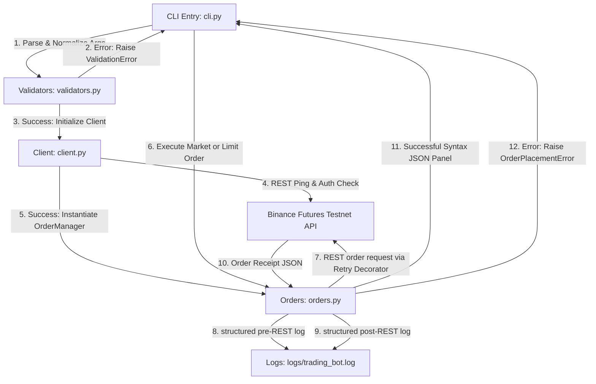

# Binance Futures Testnet Trading Bot

[](https://www.python.org/)
[](https://testnet.binancefuture.com)
[](https://en.wikipedia.org/wiki/Multitier_architecture)
[](https://github.com/Textualize/rich)
[](https://opensource.org/licenses/MIT)

A highly robust, production-quality Python trading bot designed to interact safely and securely with the **Binance Futures Testnet** using the `python-binance` library. The project features a strict separation of concerns, comprehensive validation, transient network error recovery, custom structured log formats, and an interactive, stylized console experience built with `Rich`.

---

## 🏗️ System Architecture

This project is built around **clean architecture** boundaries. Business calculations, network clients, validations, logging, and user interfaces are decoupled to maximize testability and maintainability.



### Modular Directory Tree
```
trading_bot/
│
├── bot/
│   ├── __init__.py           # Package exposures (Exports key objects)
│   ├── client.py             # Client wrapper & Network retry decorators
│   ├── orders.py             # Order execution business logic
│   ├── validators.py         # Strong input validation boundaries
│   ├── logging_config.py     # Custom StructuredFormatter configuration
│   └── cli.py                # Command-Line Interface driver
│
├── logs/
│   └── trading_bot.log       # Audit log (Generated dynamically at runtime)
│
├── requirements.txt          # Python dependencies
├── .env.example              # Env variables template
└── README.md                 # Complete documentation
```

---

## ⚡ Features Overview

*   **Premium Console UX (`Rich` upgrade)**: Rendered parameter summaries in tables, colored validation failure panels, connection status alerts, and syntax-highlighted trade receipt displays.
*   **Safety Confirmations**: Prevents unintentional trades by displaying an order confirmation panel and asking the user `Proceed? (y/n)` before dispatching API requests.
*   **Transient Network Recovery**: Custom `@retry_network_failures` exponential backoff decorator that retries connections up to 3 times before raising failures.
*   **Auditing Audit Trail**: Custom structured log format writing directly to `logs/trading_bot.log` with a clear division between multi-line `[INFO]` audit structures and `[ERROR]` failure structures.
*   **Validation Guardrails**: Standardized regex and range parameters verification checks symbols, sides, quantities, and prices locally prior to network actions, saving API rate limits.

---

## ⚙️ Setup & Installation

### 1. Prerequisites
- **Python 3.11** or higher.
- A **Binance Futures Testnet** account. Register and secure mock trade funds at [https://testnet.binancefuture.com](https://testnet.binancefuture.com).

### 2. Installation Steps
Clone or navigate to the `trading_bot` directory and install the dependencies:
```bash
pip install -r requirements.txt
```

### 3. Environment Key Setup
Duplicate `.env.example` into a new `.env` file:
```bash
cp .env.example .env
```
Open `.env` and fill in your generated Binance Futures Testnet credentials:
```env
BINANCE_API_KEY=your_testnet_api_key_here
BINANCE_API_SECRET=your_testnet_api_secret_here
```

---

## 🎮 Command-Line Interface (CLI) Usage

The trading bot CLI is launched as a Python module:

### Command Parameters
| Flag | Required | Expected Values | Description |
| :--- | :--- | :--- | :--- |
| `--symbol` | Yes | Alphanumeric (e.g. `BTCUSDT`) | The target trading pair to execute. |
| `--side` | Yes | `BUY`, `SELL` (case-insensitive) | The trade direction. |
| `--type` | Yes | `MARKET`, `LIMIT` (case-insensitive)| The order execution type. |
| `--quantity` | Yes | Positive decimal (e.g. `0.05`) | The amount of the asset to trade. |
| `--price` | No | Positive decimal (e.g. `58000`)| Required ONLY for `LIMIT` orders. |

---

### Command Examples

#### 1. Place a Market Buy Order
```bash
python -m bot.cli --symbol BTCUSDT --side BUY --type MARKET --quantity 0.01
```

#### 2. Place a Limit Sell Order
```bash
python -m bot.cli --symbol ETHUSDT --side SELL --type LIMIT --quantity 0.05 --price 3500
```

#### 3. Parameter Validation Failure (No price specified for Limit)
```bash
python -m bot.cli --symbol ETHUSDT --side SELL --type LIMIT --quantity 0.05
```

---

## 📝 Structured Logging Framework

The bot automatically formats logs inside `logs/trading_bot.log` into clean structured blocks:

### Success Log Mappings (`[INFO]`)
```
[INFO]
timestamp: YYYY-MM-DD HH:MM:SS
action: Description of system status
symbol: Alphanumeric symbol or -
side: BUY, SELL or -
order_type: MARKET, LIMIT or -
```

### Failure Log Mappings (`[ERROR]`)
```
[ERROR]
timestamp: YYYY-MM-DD HH:MM:SS
exception_type: Class name of exception caught
message: Details of the failure state
```

---

## 🛡️ License

This project is open-source and available under the [MIT License](LICENSE).
